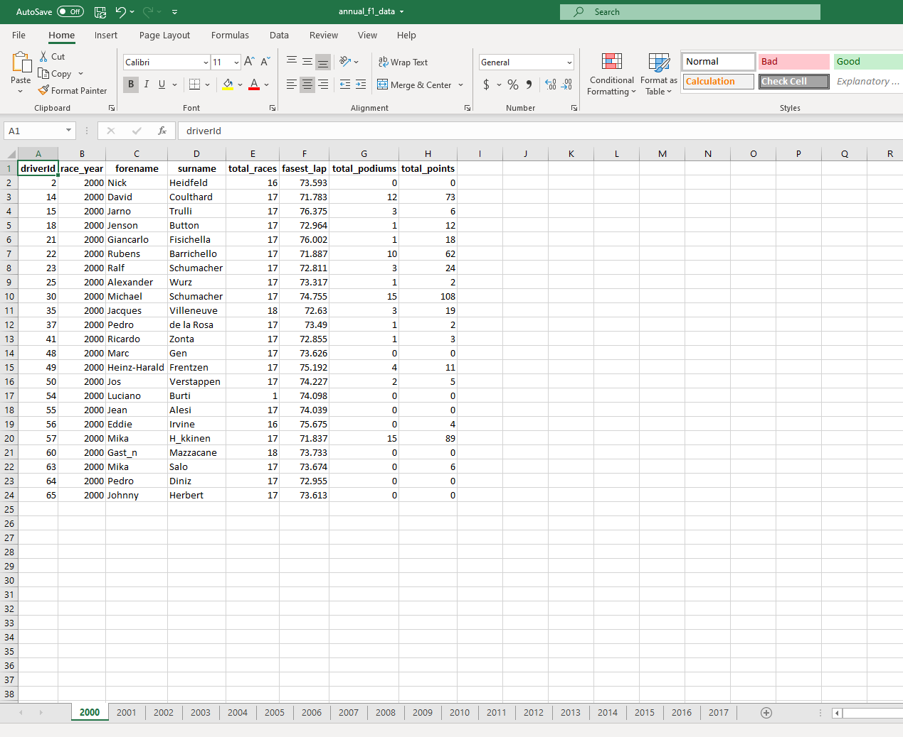
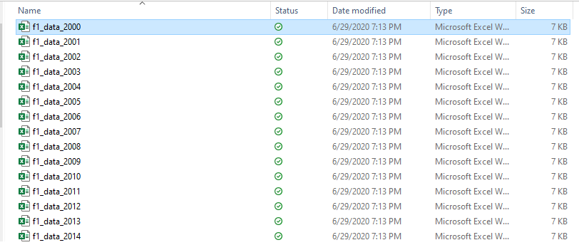

```{r setup, include=FALSE}
knitr::opts_chunk$set(echo = TRUE, warning = FALSE)
```

## Goals

Being able to export and share your work is a key step in the data analysis process. In this post I'll walk through the process of performing some group level summary statistics and exporting those grouped data frames to separate tabs within an Excel document and separate Excel workbooks.

## Packages

The key package for this demonstration will be `writexl`. It allows you to read/create Excel files without having to install other Java or Perl dependencies.

```{r, message = FALSE}
xfun::pkg_attach("dplyr", "readr", "tidyr", 
                 "purrr", "writexl", "lubridate")

```

## Data Import and Summarization

I'll be using a data set that contains performance statistics on Formula 1 drivers.

```{r}
f1_summary <- read_rds("large_data/f1_master_table.rds") %>% 
  # Removes special characters from driver names
  mutate_at(c("forename", "surname"), 
            ~iconv(x = ., from = "UTF-8", 
                   to = "ASCII", "")) %>%
  filter(race_year >= 2000) %>%
  mutate(podium = if_else(fl_position <= 3, 
                          TRUE, FALSE)) %>%
  group_by(driverId, race_year, forename, surname) %>%
  summarize(total_races = n(),
            fasest_lap = min(fastestLapTime, na.rm = TRUE),
            total_podiums = sum(podium, na.rm = TRUE),
            total_points = sum(points, na.rm = TRUE)) %>%
  ungroup()

head(f1_summary)

```

## Splitting and Exporting the Data to Separate Tabs

Now that the table is in the desired format I can split it based upon the `race_year` variable using the `group_split` function. This allows me to separate the data and keep the grouping variable in the split tables. In order for the sheet naming to work correctly I also need to name the list of data frames that I have created. This is done by using the `set_names` function. I'm choosing to use the race years to create the names for the list. The final step is to pipe the named list of data frames into the `write_xlsx` function where it it used to create the Excel workbook with it's named tabs.

```{r, message=FALSE, eval=FALSE}

f1_summary %>%
  group_split(race_year) %>%
  set_names(map_chr(.x = .,
                    .f = ~ .$race_year %>%
                      unique() %>%
                      as.character())) %>%
  write_xlsx(path = "annual_f1_data.xlsx")

```

{width=100% height=100%}

## Exporting to Multiple Excel Files

A similar process is used to export the data frames into separate Excel files. This time I will be nesting the data and mapping over the data frames to create each file. The `nest` function allows me to use the grouping variable, in this case `race_year`, to name each Excel file.

```{r, eval=FALSE}

f1_summary %>%
  mutate(ry = race_year) %>%
  nest(data = -race_year) %>% 
  arrange(race_year) %>%
  walk2(.x = .$data, .y = .$race_year,
      .f = ~write_xlsx(x = .x,
                   path = paste0("f1_data_", .y, ".xlsx")))

```

{width=100% height=100%}
