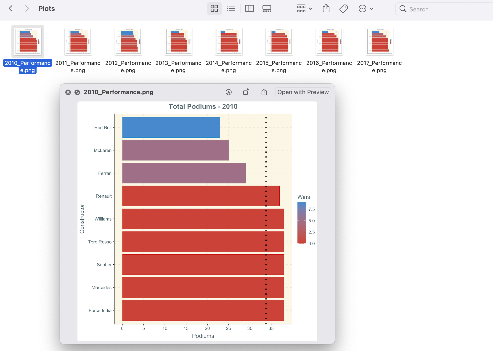

Creating insightful plots with a couple of lines of code is what makes ggplot such a powerful tool. There are times where I want to export multiple version of the same plot based upon slightly different criteria. Batch processing plots is super easy with `map()` family of functions from the purrr package.

```{r setup, include=FALSE}
knitr::opts_chunk$set(echo = TRUE, warning = FALSE)
```

# Packages

```{r pacakges, message=FALSE}
xfun::pkg_attach("tidyverse", "scales", "glue", "ggthemr")
ggthemr("solarized")
```

```{r, include=FALSE}
f1_data <- read_rds("large_data/f1_master_table.rds")
```


# Data

For this demonstration I'll be revisiting my Formula 1 data. The code below identifies the top ten constructors based upon total podiums from the year 2010 and greater. 

```{r}
top_constructors <- f1_data %>% 
  filter(race_year >= 2010) %>% 
  mutate(podium = ifelse(positionOrder >= 3, TRUE, FALSE)) %>% 
  group_by(c_name) %>% 
  summarize(total_podiums = sum(podium, na.rm = TRUE),
            .groups = "drop") %>% 
  slice_max(total_podiums, n = 10, with_ties = FALSE) %>% 
  pull(c_name)

top_podiums <- f1_data %>% 
  filter(c_name %in% top_constructors, race_year >= 2010) %>% 
  mutate(podium = ifelse(positionOrder >= 3, TRUE, FALSE),
         win = ifelse(positionOrder == 1, TRUE, FALSE)) %>%
  group_by(c_name, race_year) %>% 
  summarize(total_podiums = sum(podium, na.rm = TRUE),
            total_wins = sum(win, na.rm = TRUE),
            .groups = "drop")
```

# Creating the First Plot

Before I can batch process these plots I want to fine tune what one plot will look like. I'll start by filtering for `race_year` 2010 and creating a nice plot detailing each contructor's performance.

```{r}
top_podiums %>% 
  filter(race_year == 2010) %>% 
  mutate(avg_podiums = mean(total_podiums, na.rm = TRUE)) %>% 
  ggplot(aes(reorder(c_name, -total_podiums), total_podiums, fill = total_wins)) + geom_col() +
  geom_hline(aes(yintercept = max(avg_podiums)),
             linetype = 3,
             col = "black",
             size = 1.2) +
  scale_y_continuous(breaks = breaks_width(5)) +
  labs(x = "Constructor", y = "Podiums", 
       title = "Total Podiums - 2010",
       fill = "Wins") +
  theme(plot.title = element_text(hjust = 0.5)) + 
  coord_flip()
```

# Batch Processing

I'm happy with my plot. Now comes the fun part. I have a couple options for displaying the information for the other years. I could facet the additional plots but that gets cluttered way to fast. Batch processing is a great solution if I needed to use this plots in another presentation or share them outside of R. 

```{r, eval=FALSE}
top_podiums %>% 
  nest(data = -race_year) %>% 
  mutate(avg_podiums = map_dbl(.x = data,
                               .f = ~mean(.x$total_podiums, 
                                          na.rm = TRUE))) %>% 
  mutate(plts = pmap(.l = list(data, avg_podiums, race_year),
                     .f = ~ggplot(data = ..1, 
                                  aes(reorder(c_name, -total_podiums), 
                                      total_podiums, fill = total_wins)) + 
                       geom_col() +
                       geom_hline(aes(yintercept = ..2),
                                  linetype = 3,
                                  col = "black",
                                  size = 1.2) +
                       scale_y_continuous(breaks = breaks_width(5)) +
                       labs(x = "Constructor", y = "Podiums", 
                            title = glue("Total Podiums - {..3}"),
                            fill = "Wins") +
                       theme(plot.title = element_text(hjust = 0.5)) + 
                       coord_flip())) %>% 
  walk2(.x = .$plts, .y = .$race_year,
        .f = ~ggsave(glue("Plots/{.y}_Performance.png"),
                     plot = .x))
```

{width=100% height=100%}


