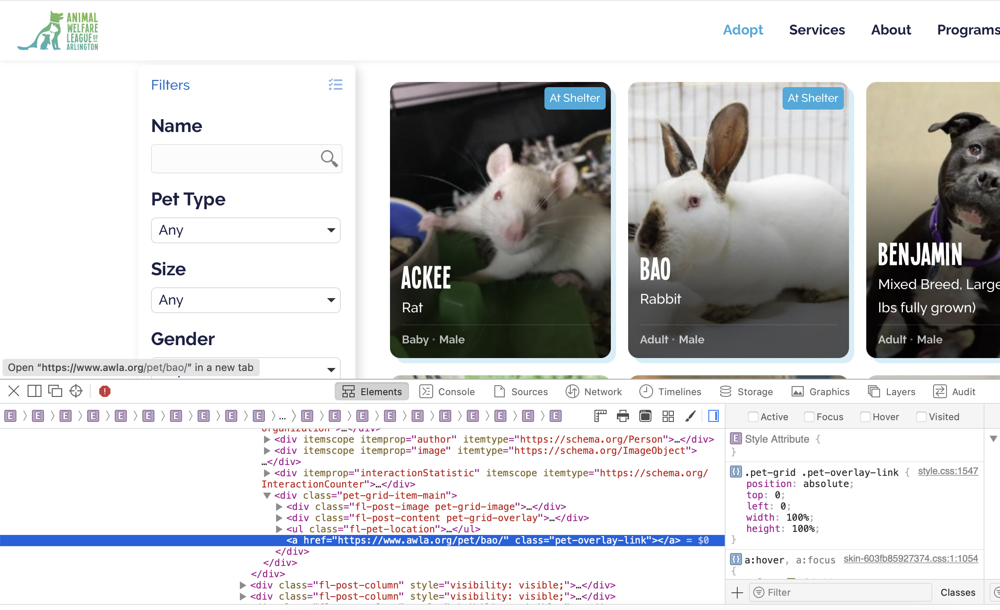
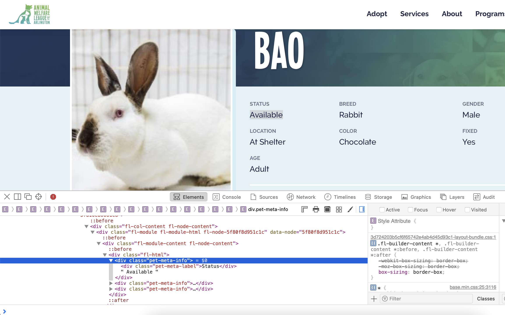

```{r setup, include=FALSE}
knitr::opts_chunk$set(echo = TRUE, warning = FALSE)
```

```{r, message=FALSE, include=FALSE}
## R
xfun::pkg_attach('reticulate', 'dplyr', 'tidyr',
                 'ggplot2', 'ggthemr', 'scales', 'readr')
ggthemr("solarized")
use_condaenv("myenv")
```

## The goal

Scraping is great for retrieving data from websites without having to complete repetitive tasks. This post will focus on using Python and the Scrapy library to create a spider that can crawl a website and save information of interest. I've chosen to crawl the Animal Welfare League of Arlington site The goal is to collect information on each of the animals currently available for adoption on the site.

## Where to crawl?

Before I can create my spider I need to know where the information is located within the website. Almost all browsers offer an inspection option that lets you see the HTML elements that build a particular portion of the site. I'll start from that lists all the pets available.

```{r out.extra="class=external", echo=FALSE}

```

```{r out.extra="class=external", echo=FALSE}

```

The links to each pet's page can be found in `href` attribute of all `a` tags that have a class named 'pet-overlay-link'. A similar inspection of the page for an individual pet helps me identify the class attributes needed to locate the various stats on each pet. With this information I can move on to testing my XPath strings before I create my spider.

## Test run

Scrapy offers ways to test XPath and CSS strings with it's command line tool but I prefer to test my strings in Python scripts. I'll start by pulling the HTML from each page I want to test, and loading them into Selector objects.

```{python, include=FALSE}
from scrapy import Selector

# Used so that I don't have to pull data from the page every time I want to Knit the file
with open('data/all_pets_homepage.txt', 'r') as file:
  text = file.read()

sel_all = Selector(text=text)

with open('data/bao_page.txt', 'r') as file:
  text = file.read()

sel_pet = Selector(text=text)

```

```{python, eval=FALSE}
import requests
from scrapy import Selector

url = 'https://www.awla.org/adopt/all-pets/'
text = requests.get(url).text
sel_all = Selector(text=text)

url = 'https://www.awla.org/pet/bao/'
text = requests.get(url).text
sel_pet = Selector(text=text)
```

Now that I have the Selector objects I can test out all of my XPath strings to ensure I'm retrieving the right information.

```{python}
# The links to each pet's page
sel_all.xpath('//a[@class="pet-overlay-link"]/@href').getall()[:2]

# The name of the pet
sel_pet.xpath('//h1/span[@class="fl-heading-text"]/text()').getall()

# The labels for each type of data collected for the pets
sel_pet.xpath('//div[@class="pet-meta-label"]/text()').getall()

# The values for each label
sel_pet.xpath('//div[@class="pet-meta-info"]/text()').getall()
```

The good news is that the XPath strings worked! But it looks like I'm also getting some unnecessary data. My retrieval of the labels section includes the text 'Share me!' and the values for each label on the table contain `\n` strings for line breaks. I'll need to do some light cleansing if I want use this data for any type of analysis.

Scrapy does offer a framework for creating specific classes for item retrieval. This can help to keep the actual spider code cleaner and easier to maintain. I'm going to do all of my cleansing operations in the spider class so that everything is in one file.

## Creating the spider

```{python, eval=FALSE}
## Python
import scrapy
from scrapy.crawler import CrawlerProcess


class PetSpider(scrapy.Spider):
    name = 'pet-spider'
    start_urls = ['https://www.awla.org/adopt/all-pets/',
                  'https://www.awla.org/adopt/all-pets/?_paged=2',
                  'https://www.awla.org/adopt/all-pets/?_paged=3']

    def parse(self, response):
        for link in response.xpath('//a[@class="pet-overlay-link"]/@href').getall():
            yield response.follow(url=link, callback=self.parse_pet_pages)

    def parse_pet_pages(self, response):
        # Gets all of the data labels. Removes the last label for the 'Share me!' item
        pet_label = response.xpath('//div[@class="pet-meta-label"]/text()').getall()
        pet_label = pet_label[:-1]
        # Gets all of the info for each label.
        # Using a list comprehension to strip the whites pace and line breaks
        # Also removing empty strings with the outer portion of the list comprehension
        pet_info = response.xpath('//div[@class="pet-meta-info"]/text()').getall()
        pet_info = [i for i in [x.strip() for x in pet_info] if i]
        # Concatenating the dictionaries using the ** method to unpack and paste them together.
        # This is done so that I can use a dictionary comprehension to create key: value pairs
        # for the pet labels and info
        yield {
            **{'pet_name': response.xpath('//h1/span[@class="fl-heading-text"]/text()').getall()},
            **{x.lower(): y for x, y in zip(pet_label, pet_info)},
            **{'pet_link': response.xpath('//link[@rel="canonical"]/@href').getall()}
        }


# Exporting the data yielded from the crawl to CSV
process = CrawlerProcess(settings={
    "FEEDS": {
        "pet_data_export.csv": {"format": "csv"},
    },
    "DOWNLOAD_DELAY": 2,
    "COOKIES_ENABLED": False
})
process.crawl(PetSpider)
process.start()

```


## Visaulization in R

Success! The spider has done it's job and produced a CSV file that contains all the information I want. Now I can perform some quick analysis of the data.

Lets take a look at the distribution of pets across different age groups, gender, locations, and neutered status.

```{r}

pet_data <- read_csv("data/pet_data_export.csv")
pet_data_long <- pivot_longer(pet_data, names_to = "metric", 
                              cols = c(everything(), -pet_name, -pet_link))

pet_data_long %>% 
  filter(metric %in% c("age", "gender", "fixed", "location")) %>% 
  ggplot(aes(value)) + geom_bar() + facet_wrap(~metric, scales = "free_x") +
  theme(axis.title.x = element_blank())

```

Next I want to see the counts for the breeds and color.

```{r}
pet_data %>% 
  group_by(breed) %>% 
  summarize(breed_count = n(),
            .groups = "drop") %>% 
  ggplot(aes(reorder(breed, breed_count), breed_count)) + 
  geom_col() + coord_flip() +
  labs(y = "count", x = "breed")


pet_data %>% 
  group_by(color) %>% 
  summarize(color_count = n(),
            .groups = "drop") %>% 
  ggplot(aes(reorder(color, color_count), color_count)) + 
  geom_col() + coord_flip() +
  labs(y = "count", x = "color")
```

